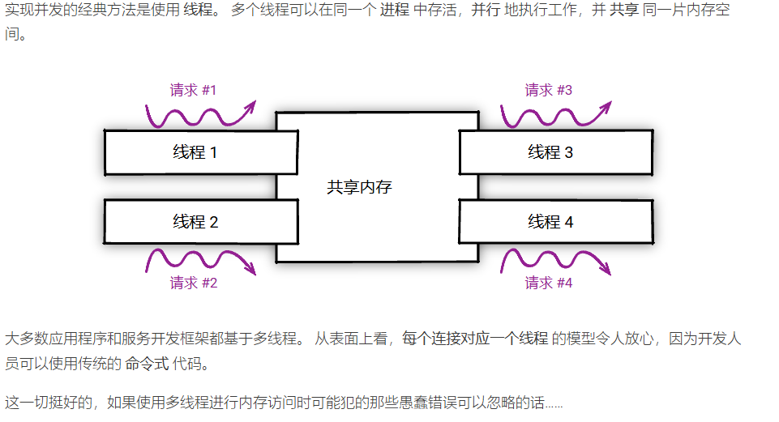
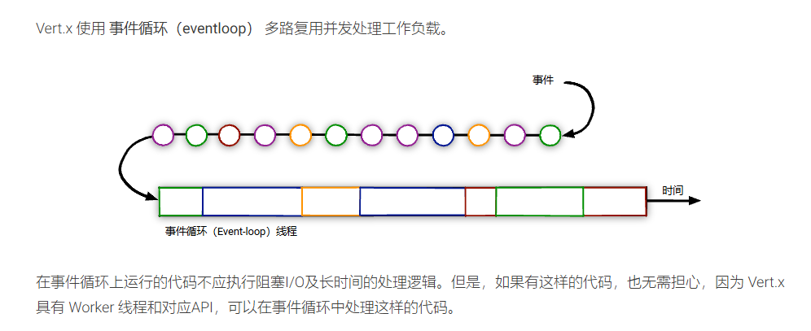
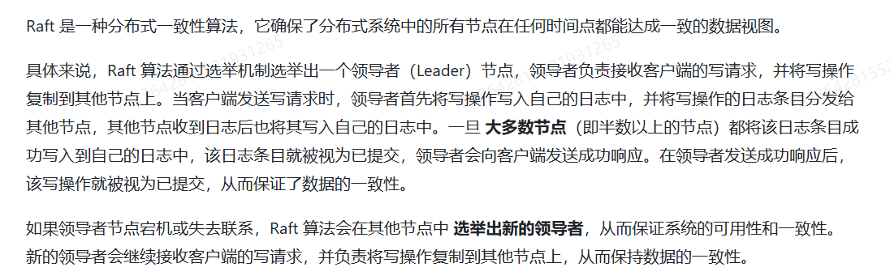
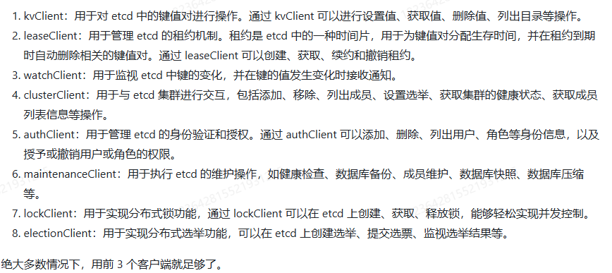
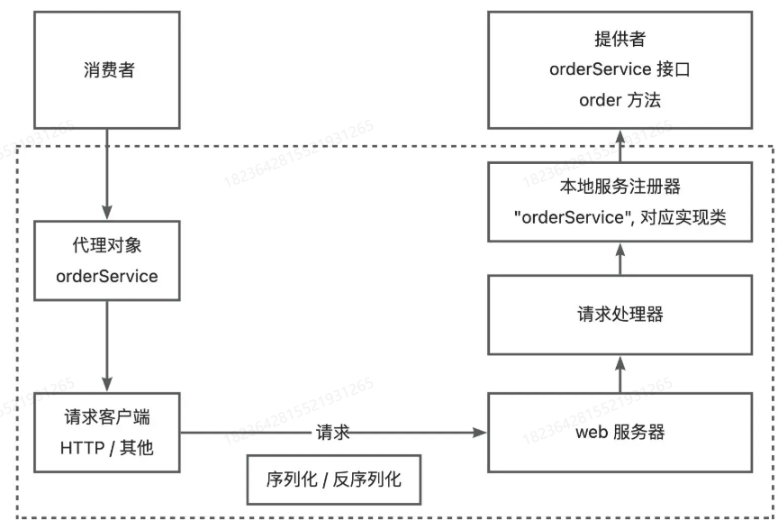
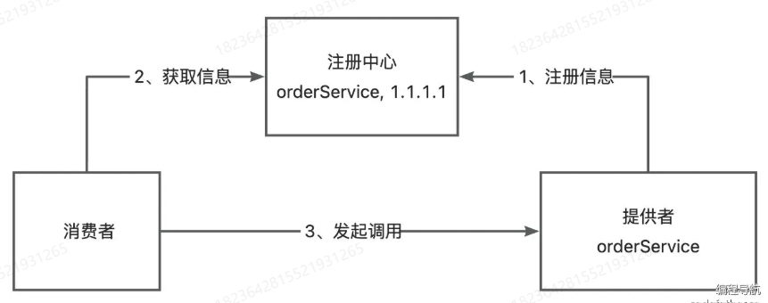
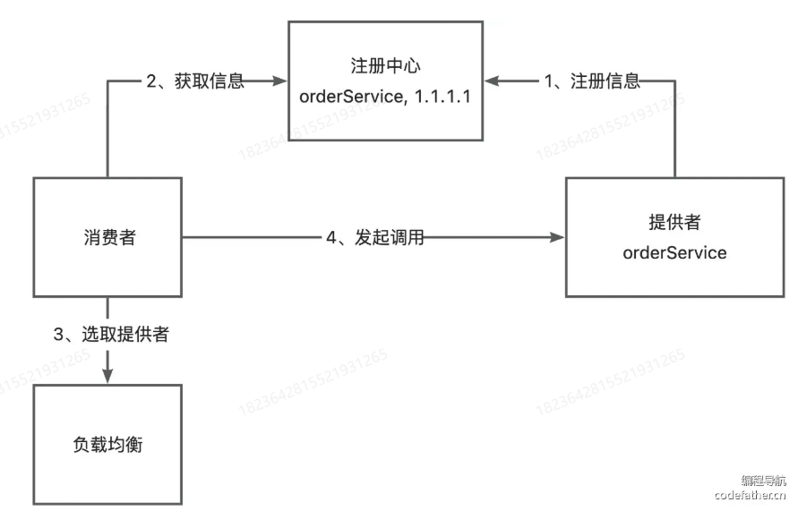
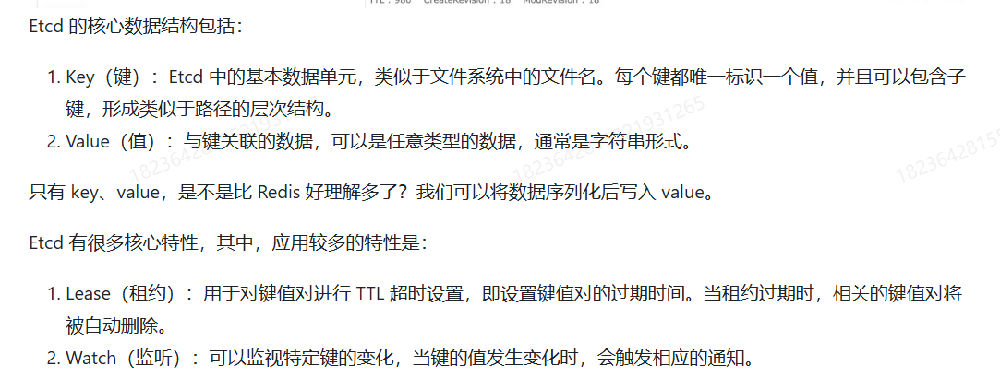
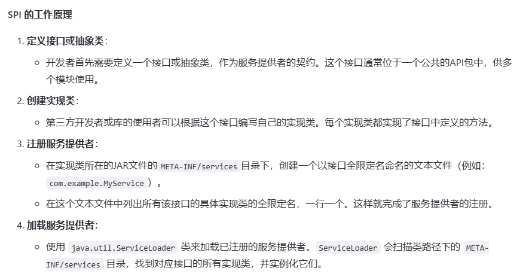

# RPC
## VERT.X

但是当超负荷的时候，会出现很严重的阻塞问题。

### tomcat的流程

### vert.x相比Tomcat

### 零拷贝

## Dubbo
### 结构

服务治理控制面。服务治理控制面不是特指如注册中心类的单个具体组件，而是对 Dubbo 治理体系的抽象表达。控制面包含协调服务发现的注册中心、流量管控策略、Dubbo Admin 控制台等，如果采用了 Service Mesh 架构则还包含 Istio 等服务网格控制面。

Dubbo 数据面。数据面代表集群部署的所有 Dubbo 进程，进程之间通过 RPC 协议实现数据交换，Dubbo 定义了微服务应用开发与调用规范并负责完成数据传输的编解码工作。
服务消费者 (Dubbo Consumer)，发起业务调用或 RPC 通信的 Dubbo 进程
服务提供者 (Dubbo Provider)，接收业务调用或 RPC 通信的 Dubbo 进程
### Dubbo 数据面
从数据面视角，Dubbo 帮助解决了微服务实践中的以下问题：

Dubbo 作为 服务开发框架 约束了微服务定义、开发与调用的规范，定义了服务治理流程及适配模式
Dubbo 作为 RPC 通信协议实现 解决服务间数据传输的编解码问题

#### 服务开发框架
微服务的目标是构建足够小的、自包含的、独立演进的、可以随时部署运行的分布式应用程序，几乎每个语言都有类似的应用开发框架来帮助开发者快速构建此类微服务应用，比如 Java 微服务体系的 Spring Boot，它帮 Java 微服务开发者以最少的配置、最轻量的方式快速开发、打包、部署与运行应用。

微服务的分布式特性，使得应用间的依赖、网络交互、数据传输变得更频繁，因此不同的应用需要定义、暴露或调用 RPC 服务，那么这些 RPC 服务如何定义、如何与应用开发框架结合、服务调用行为如何控制？这就是 Dubbo 服务开发框架的含义，Dubbo 在微服务应用开发框架之上抽象了一套 RPC 服务定义、暴露、调用与治理的编程范式，比如 Dubbo Java 作为服务开发框架，当运行在 Spring 体系时就是构建在 Spring Boot 应用开发框架之上的微服务开发框架，并在此之上抽象了一套 RPC 服务定义、暴露、调用与治理的编程范式
Dubbo 作为服务开发框架包含的具体内容如下：

RPC 服务定义、开发范式。比如 Dubbo 支持通过 IDL 定义服务，也支持编程语言特有的服务开发定义方式，如通过 Java Interface 定义服务。
RPC 服务发布与调用 API。Dubbo 支持同步、异步、Reactive Streaming 等服务调用编程模式，还支持请求上下文 API、设置超时时间等。
服务治理策略、流程与适配方式等。作为服务框架数据面，Dubbo 定义了服务地址发现、负载均衡策略、基于规则的流量路由、Metrics 指标采集等服务治理抽象，并适配到特定的产品实现。
### Dubbo 服务治理
地址发现
Dubbo 服务发现具备高性能、支持大规模集群、服务级元数据配置等优势，默认提供 Nacos、Zookeeper、Consul 等多种注册中心适配，与 Spring Cloud、Kubernetes Service 模型打通，支持自定义扩展。

负载均衡
Dubbo 默认提供加权随机、加权轮询、最少活跃请求数优先、最短响应时间优先、一致性哈希和自适应负载等策略

流量路由
Dubbo 支持通过一系列流量规则控制服务调用的流量分布与行为，基于这些规则可以实现基于权重的比例流量分发、灰度验证、金丝雀发布、按请求参数的路由、同区域优先、超时配置、重试、限流降级等能力。

链路追踪
Dubbo 官方通过适配 OpenTelemetry 提供了对 Tracing 全链路追踪支持，用户可以接入支持 OpenTelemetry 标准的产品如 Skywalking、Zipkin 等。另外，很多社区如 Skywalking、Zipkin 等在官方也提供了对 Dubbo 的适配。

可观测性
Dubbo 实例通过 Prometheus 等上报 QPS、RT、请求次数、成功率、异常次数等多维度的可观测指标帮助了解服务运行状态，通过接入 Grafana、Admin 控制台帮助实现数据指标可视化展示。

Dubbo 服务治理生态还提供了对 API 网关、限流降级、数据一致性、认证鉴权等场景的适配支持。

### Dubbo Admin
Admin 控制台提供了 Dubbo 集群的可视化视图，通过 Admin 你可以完成集群的几乎所有管控工作。

查询服务、应用或机器状态
创建项目、服务测试、文档管理等
查看集群实时流量、定位异常问题等
流量比例分发、参数路由等流量管控规则下发
### Dubbo 优势
完全支持 Spring & Spring Boot 开发模式，同时在服务发现、动态配置等基础模式上提供与 Spring Cloud 对等的能力。
是企业级微服务实践方案的整体输出，Dubbo 考虑到了企业微服务实践中会遇到的各种问题如优雅上下线、多注册中心、流量管理等，因此其在生产环境的长期维护成本更低
在通信协议和编码上选择更灵活，包括 rpc 通信层协议如 HTTP、HTTP/2(Triple、gRPC)、TCP 二进制协议、rest等，序列化编码协议Protobuf、JSON、Hessian2 等，支持单端口多协议。
Dubbo 从设计上突出服务服务治理能力，如权重动态调整、标签路由、条件路由等，支持 Proxyless 等多种模式接入 Service Mesh 体系
高性能的 RPC 协议编码与实现，
Dubbo 是在超大规模微服务集群实践场景下开发的框架，可以做到百万实例规模的集群水平扩容，应对集群增长带来的各种问题
Dubbo 提供 Java 外的多语言实现，使得构建多语言异构的微服务体系成为可能

## SPI

上述功能完全可以自己写一份

## Etcd

### Etcd 使用教程

## 遇见的问题
#### 当写一些配置的时候，需要注意升级变化的时候进行排查。